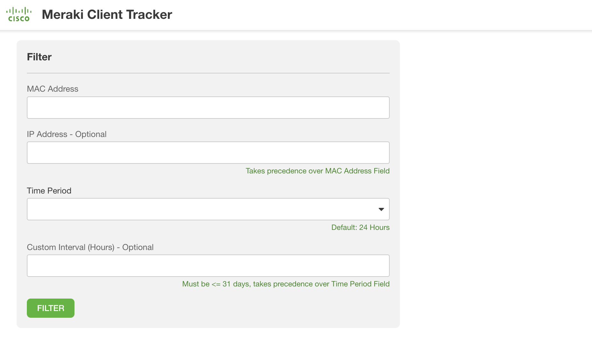
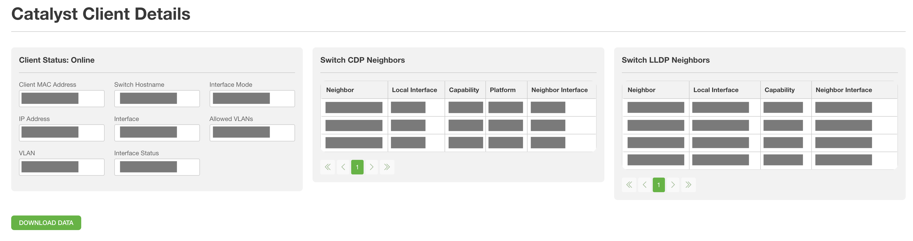
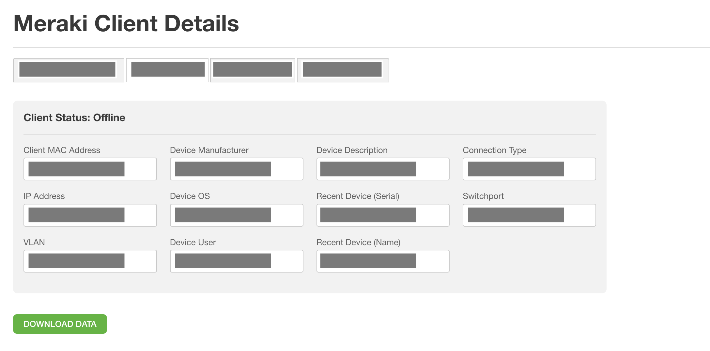
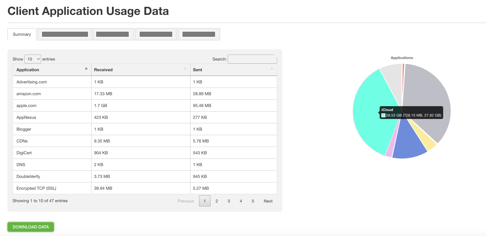

# Meraki Client Tracker

This flask app gathers Client Details (MAC, IP, CDP Neighbors, etc.) across Catalyst Switches and across the Meraki networks in an organization. Information is gathered based on MAC address and time period (optionally: IP Address).
The app helps track a client across a mixed network, identifying the most recent connections on both Catalyst Switches and Meraki Networks.

**Note**:
* [MAC Address Tracking](https://documentation.meraki.com/MX/Monitoring_and_Reporting/Client-Tracking_Options) is assumed to be in use for the Meraki Networks
* IP Address tracking will search Catalyst Switches for the IP, obtain the corresponding MAC Address, and query the Meraki Network with the MAC Address.
  * MAC Address tracking is the safer query option, as IP Tracking has several possible drawbacks:
    * The IP may not be the same between local networks and the Meraki networks
    * Local IPs may be reused across Catalyst Switches (the first switch to respond with a valid IP in its ARP table, set's the MAC address)

## Contacts
* Trevor Maco

## Solution Components
* Meraki
* Catalyst
* Flask
* Python 3.11

## Prerequisites
#### Meraki API Keys
In order to use the Meraki API, you need to enable the API for your organization first. After enabling API access, you can generate an API key. Follow these instructions to enable API access and generate an API key:
1. Login to the Meraki dashboard
2. In the left-hand menu, navigate to `Organization > Settings > Dashboard API access`
3. Click on `Enable access to the Cisco Meraki Dashboard API`
4. Go to `My Profile > API access`
5. Under API access, click on `Generate API key`
6. Save the API key in a safe place. The API key will only be shown once for security purposes, so it is very important to take note of the key then. In case you lose the key, then you have to revoke the key and a generate a new key. Moreover, there is a limit of only two API keys per profile.

> For more information on how to generate an API key, please click [here](https://developer.cisco.com/meraki/api-v1/#!authorization/authorization). 

> Note: You can add your account as Full Organization Admin to your organizations by following the instructions [here](https://documentation.meraki.com/General_Administration/Managing_Dashboard_Access/Managing_Dashboard_Administrators_and_Permissions).

## Installation/Configuration
1. Clone this repository with `git clone [repository name]`
2. Add Meraki API key and Organization Name to environment variables located in `config.py`
```python
MERAKI_API_KEY = ""
ORG_NAME = ""
```
3. Add Catalyst Switch information to the list in `config.py`. These Switches will be queried by the application. 
```python
SWITCH_INFO = [
     {
        "device_type": "cisco_ios",
        "ip": "X.X.X.X",
        "username": "",
        "password": "",
        "secret": ""
    }   
]
```
**Note:** Please ensure SSH is configured on each Catalyst Switch, as this is required for the Netmiko SSH connection. For more information on Netmiko, consult this [guide](https://pyneng.readthedocs.io/en/latest/book/18_ssh_telnet/netmiko.html). 

4. Set up a Python virtual environment. Make sure Python 3 is installed in your environment, and if not, you may download Python [here](https://www.python.org/downloads/). Once Python 3 is installed in your environment, you can activate the virtual environment with the instructions found [here](https://docs.python.org/3/tutorial/venv.html).
5. Install the requirements with `pip3 install -r requirements.txt`

## Usage
To run the program, use the command:
```
flask run
```

Navigate to the Flask URL, and the main page will be displayed:



To get client information, provide a MAC Address (or IP), and a Time Period (or Custom Interval). The script will first query all Catalyst Switches provided in the `config.py` list, then it will query the Meraki Cloud.

The 3 Main Pieces of Client Data Are:

* Catalyst Client Details (displayed only if data is returned):



* Meraki Client Details



* Meraki App Usage Details



Each piece of data can be downloaded as an Excel file as well.

# Screenshots


### LICENSE

Provided under Cisco Sample Code License, for details see [LICENSE](LICENSE.md)

### CODE_OF_CONDUCT

Our code of conduct is available [here](CODE_OF_CONDUCT.md)

### CONTRIBUTING

See our contributing guidelines [here](CONTRIBUTING.md)

#### DISCLAIMER:
<b>Please note:</b> This script is meant for demo purposes only. All tools/ scripts in this repo are released for use "AS IS" without any warranties of any kind, including, but not limited to their installation, use, or performance. Any use of these scripts and tools is at your own risk. There is no guarantee that they have been through thorough testing in a comparable environment and we are not responsible for any damage or data loss incurred with their use.
You are responsible for reviewing and testing any scripts you run thoroughly before use in any non-testing environment.